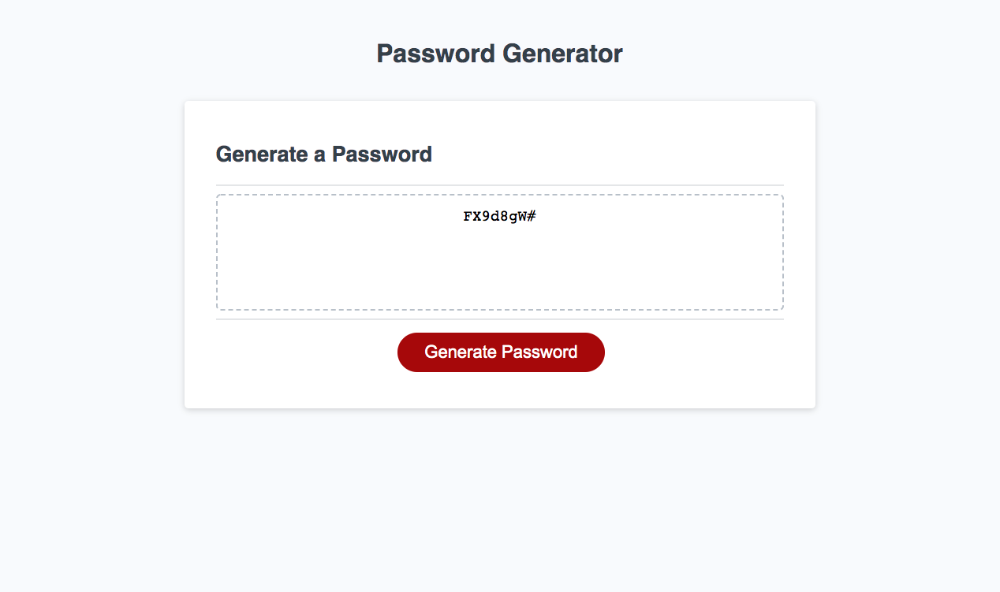

# Random Password Generator

## Overview

For this project I used JavaScript to make a random password generator.

## Tools used:

HTML, CSS, JavaScript.

## Link:

https://chasechri.github.io/challenge-3-randompword/

## Credits:

https://developer.mozilla.org/en-US/docs/Web/JavaScript/Guide/Loops_and_iteration
